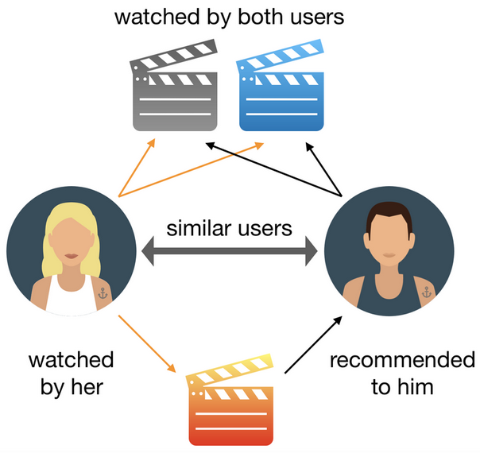

# Giới thiệu
Hệ thống gợi ý giúp phân tích dữ liệu người dùng và xếp hạng phim dựa trên sở thích cá nhân, tạo ra danh sách nội dung được cá nhân hóa. Mục tiêu là giúp người dùng tìm thấy nội dung họ yêu thích trong khoảng thời gian ngắn, khoảng 90 giây. Hệ thống gợi ý không chỉ cải thiện trải nghiệm người dùng mà còn có tác động tích cực đến kinh doanh, giúp tăng thời gian người dùng dành trên nền tảng, giảm tỷ lệ hủy đăng ký, và thu hút người dùng mới.

## Lợi ích đối với người dùng
- **Khám phá nội dung mới:** Hệ thống gợi ý giúp người dùng phát hiện những bộ phim và chương trình truyền hình mới dựa trên sở thích cá nhân.
- **Tiết kiệm thời gian:** Người dùng không cần phải tốn nhiều thời gian tìm kiếm, vì hệ thống sẽ tự động đưa ra những lựa chọn phù hợp ngay trên trang chủ.
- **Trải nghiệm cá nhân hóa:** Mỗi người dùng sẽ có một danh sách gợi ý riêng, phù hợp với hành vi và sở thích cá nhân.
  
## Đối tượng nghiên cứu

Ở bài nãy sẽ tập trung nghiên cứu vào Collaborative Filtering (Lọc cộng tác) và thuật toán KNN

### 1. Collaborative Filtering (Lọc cộng tác):
Triển khai các thuật toán lọc cộng tác để cải thiện hệ thống gợi ý của mình. Các mô hình lọc cộng tác phân tích sở thích của người dùng và đề xuất nội dung dựa trên hành vi của những người dùng tương tự. Nguyên lý cơ bản của lọc cộng tác là "những người dùng có sở thích giống nhau sẽ có xu hướng thích những nội dung tương tự". 

***Ví dụ:*** Nếu Người dùng A và Người dùng B có cùng sở thích xem các chương trình truyền hình hoặc phim ảnh, thuật toán sẽ xác định sự tương đồng này và đề xuất các chương trình mà Người dùng B đã xem và thích nhưng Người dùng A chưa xem. Điều này giúp tạo ra một danh sách gợi ý cá nhân hóa hơn, dựa trên dữ liệu thực tế từ cộng đồng người dùng.

### 2. Thuật toán KNN:
Thuật toán K-Nearest Neighbors (KNN) là một phương pháp học không giám sát dùng để phân loại hoặc dự đoán dựa trên sự tương đồng giữa các điểm dữ liệu. Trong ngữ cảnh gợi ý, KNN được sử dụng để tìm các nội dung tương tự hoặc người dùng tương tự để đưa ra các gợi ý.
#### Cách ứng dụng:
- **Tìm các bộ phim hoặc người dùng tương tự:** KNN có thể được sử dụng để tìm những bộ phim hoặc người dùng có đặc điểm tương tự. 
- **Xác định độ tương đồng giữa các bộ phim:** KNN giúp xác định độ tương đồng giữa các bộ phim dựa trên các thuộc tính của chúng, chẳng hạn như thể loại, diễn viên, và các đánh giá của người dùng. Điều này giúp hệ thống đề xuất các nội dung tương tự mà người dùng có thể thích.
- **Tối ưu hóa hiệu suất:** KNN thường cần tối ưu hóa để xử lý khối lượng dữ liệu lớn và cải thiện thời gian phản hồi. Các kỹ thuật như Approximate Nearest Neighbors (ANN) có thể được sử dụng để giảm độ phức tạp tính toán.

***Ví dụ:*** Nếu người dùng A và người dùng B có lịch sử xem tương tự, gợi ý cho người dùng A có thể dựa trên những bộ phim mà người dùng B thích.
