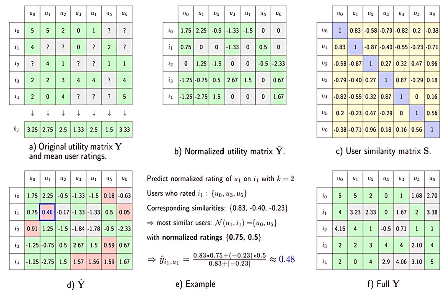

# Introduction.  
The recommendation system analyzes user data and ranks movies based on personal preferences, creating a personalized content list. Its goal is to help users find content they love within 90 seconds. This system not only enhances user experience but also positively impacts businesses by increasing user engagement, reducing churn rates, and attracting new users.  

## User Benefits  
- **Discover New Content**: Helps users explore movies and shows tailored to their tastes.  
- **Save Time**: Eliminates the need for extensive searching by presenting curated recommendations directly on the homepage.  
- **Personalized Experience**: Each user receives a unique list of recommendations based on their behavior and preferences.  

## Research Subject 

This study focuses on **Collaborative Filtering** and the **KNN Algorithm**.  

### 1. Collaborative Filtering  
Collaborative filtering algorithms analyze user preferences and suggest content based on the behavior of similar users. The principle behind collaborative filtering is:  
> **"Users with similar interests tend to like similar content."**  

#### Example:  
If User A and User B share similar tastes in movies or shows, the algorithm identifies this similarity and recommends content that User B has watched and liked but User A hasn’t seen yet. This creates a more personalized recommendation list based on real community data.  

### 2. K-Nearest Neighbors (KNN)  
The **KNN algorithm** is an unsupervised learning method used for classification or prediction based on the similarity between data points. In recommendation systems, KNN helps identify similar content or users for generating recommendations.  

#### Application:  
- **Find Similar Movies or Users**: KNN can identify similar movies or users based on their attributes.  
- **Determine Movie Similarity**: KNN evaluates similarity between movies using features like genre, actors, and user ratings.  
- **Performance Optimization**: Techniques such as Approximate Nearest Neighbors (ANN) improve scalability and response times for large datasets.  

#### Example:  
If User A and User B have similar viewing histories, recommendations for User A can be derived from movies liked by User B.  

# Operating Principles.  

## 1. Collaborative Filtering  

**Steps:**  
a) Calculate column averages.  
b) Normalize the matrix by subtracting the averages.  
c) Compute correlation coefficients for the normalized matrix.  
d) Predict ratings for unrated positions in the matrix.  
e) Apply the prediction formula to generate ratings.  
f) Convert predictions to actual rating values.  

Recommendations are generated by selecting movies with the highest predicted ratings.  

## 2. K-Nearest Neighbors (KNN): 
 

### a. Initial Data  
- Data is divided into two classes:  
  - **Class A**: Represented by red stars.  
  - **Class B**: Represented by green triangles.  
- A new data point (indicated by "?") needs classification.  

### b. Calculate Distance  
- The algorithm calculates the distance between the new point ("?") and all points in the dataset.  
- Dashed lines indicate distances between the new point and existing data points.  

### c. Find Neighbors & Assign Label  
- Identify the **k** nearest neighbors (e.g., \( k = 3 \)).  
- Check the labels of the nearest neighbors:  
  - If the majority belong to **Class A**, classify the new point as **Class A**.  
  - If the majority belong to **Class B**, classify the new point as **Class B**.  
